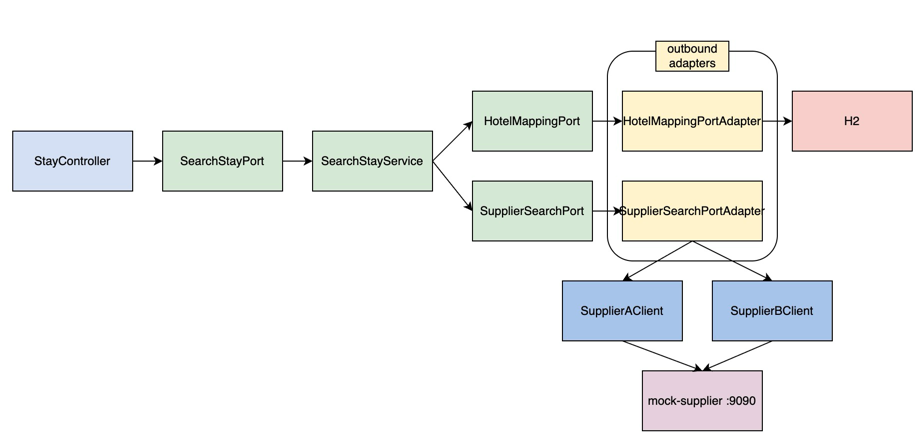

# channel-link

여러 상품 공급사(Supplier)의 서로 다른 API를 하나의 표준 모델로 통합해서, 단일 검색 API로 노출하는 백엔드 서비스

설계 의사결정의 배경과 트레이드오프는 [`docs/JOURNAL.MD`](docs/JOURNAL.MD)에, AI 페어 프로그래밍 활용 내역은 [`docs/AI.md`](docs/AI.md)에 정리돼 있습니다.

## 목차

- [체크리스트](#체크리스트)
- [기술 스택](#기술-스택)
- [시스템 아키텍처](#시스템-아키텍처)
- [주요 설계 의사결정](#주요-설계-의사결정)
- [트레이드오프 및 한계점](#트레이드오프-및-한계점)
- [실행 방법](#실행-방법)
- [API 명세](#api-명세)
- [프로젝트 구조](#프로젝트-구조)

## 체크리스트

### 기능 체크리스트

- [x] 통합 검색 API — `GET /api/v1/stays/search` (날짜·인원 조건으로 공급사 A/B를 한 번에 검색)
- [x] 서로 다른 실패 신호(A: HTTP 상태 / B: HTTP 200 + `resultCode`)를 `SupplierCallException` 하나로 통일
- [x] 부분 실패 허용 — 공급사 하나가 실패해도 나머지는 정상 응답, `failedSuppliers`로 실패한 공급사 표시
- [x] 연박 예약 가능 객실 수 계산 — 기간 내 날짜별 잔여 객실 수의 최솟값(하루라도 0이면 전체 기간 예약 불가)
- [x] 숙소/객실 타입 내부 식별자 매핑 — 최초 조회 시 자동 생성(`resolveOrCreate`), 이후 재사용
- [x] 숙소 목록 갱신 — 기동 시 1회 실행돼 매핑 테이블을 채움
- [x] 신규 공급사 추가에 열린 구조(OCP) — 레지스트리/자동 수집 패턴, 기존 코드 수정 없이 어댑터 추가만으로 확장

### 추가 구현

- [x] 재시도 정책 — resilience4j `@Retry`, 5xx·네트워크 오류만 재시도(4xx·비즈니스 실패는 재시도 안 함)
- [x] 서킷브레이커 — resilience4j `@CircuitBreaker`, 공급사별 독립
- [x] 요금/재고 캐시 전략 — TTL 설계·캐시 스탬피드 방지·정합성 오차 허용범위 모두 구현 및 부하 테스트로 근거 확보
- [x] API 문서 자동화 — springdoc-openapi(Swagger UI)
- [x] 단위 테스트 — 핵심 도메인 로직(`SearchStayService`) 및 값 객체 검증 로직
- [x] 성능/동시성 부하 테스트 — k6 기반, 재현 가능한 스크립트로 제공

## 기술 스택

| 분류       | 사용 기술 |
|----------|---|
| 언어 / 런타임 | Java 21 (Virtual Threads) |
| 프레임워크    | Spring Boot 3.4.1 |
| 빌드       | Gradle (Kotlin DSL), 멀티모듈 |
| 영속성      | Spring Data JPA + H2 (인메모리) — 매핑 테이블만 저장하면 돼서, 별도 DB 서버 설치 없이 기동 즉시 실행 가능한 H2로 충분 |
| 캐시       | Spring Cache + Caffeine (`AsyncCache` 포함) — 단일 인스턴스라 분산 캐시(Redis)가 불필요, Spring Boot 기본 통합 + `AsyncCache`의 스탬피드 방지가 필요했음 |
| 재시도      | resilience4j (Retry, CircuitBreaker) + resilience4j-reactor + Spring AOP |
| API 문서   | springdoc-openapi (Swagger UI) |
| 테스트      | JUnit 5, Mockito, AssertJ |
| 부하 테스트   | k6, bash + Python(집계용) |

## 시스템 아키텍처

헥사고날(Port & Adapter) 아키텍처를 멀티모듈로 물리적으로 강제합니다 — `domain`/`application` 모듈의 `build.gradle.kts`에는 Spring·JPA·WebClient 등 어떤 프레임워크 의존성도 없어서, 프레임워크 코드가 섞이는 순간 컴파일이 깨집니다.

### 모듈 별 설명

- **domain**: 표준 모델, 매핑 모델, Port 인터페이스만 존재.
- **application**: Port(in)의 구현체 = 유스케이스. Spring 의존성 없이 순수 자바로 작성, 조립은 `bootstrap`이 담당
- **adapter-in-web**: REST 컨트롤러, Swagger
- **adapter-out-supplier**: 공급사 HTTP 연동, WebClient/Reactor, 캐시, 재시도/서킷브레이커 — 리액티브 타입은 이 모듈 밖으로 절대 안 나감
- **adapter-out-persistence**: 매핑 테이블 JPA 영속화
- **bootstrap**: 위 모든 모듈을 조립해서 실행하는 최종 애플리케이션(`@SpringBootApplication`)
- **mock-supplier**: 별도 프로세스(9090)로 뜨는 공급사 A/B 목업. 실제 서비스(`bootstrap`, 8080)와 완전히 분리

### 숙소 목록 갱신(①) 흐름
기동 시 `CommandLineRunner`가 1회 실행 — `RefreshHotelCatalogService`가 등록된 모든 `SupplierPort`의 `fetchHotelCatalog()`(blocking)를 호출해서 `HotelMapping`/`RoomTypeMapping`을 채웁니다. 이게 한 번도 안 돌면 매핑 테이블이 비어 있어서 검색 결과가 항상 빈 배열입니다.

### 통합 검색(②) 데이터 흐름



### 데이터 모델 (ERD)

`HotelMapping`/`RoomTypeMapping`만 영속 대상이라 스키마가 단순합니다. 둘 사이에 외래키 관계는 없고(각자 `(supplier_code, hotel_code[, room_type_code])`에 유니크 제약), `internal_hotel_id`/`internal_room_type_id`(UUIDv7)가 각자의 PK입니다.


## 주요 설계 의사결정

아래는 요약이며, 각 항목의 대안·이유·트레이드오프 전체는 [`docs/JOURNAL.MD`](docs/JOURNAL.MD)에 있습니다.

1. **멀티모듈 + 헥사고날**: `domain`/`application`의 빌드 파일에 프레임워크 의존성을 원천 차단해서, 아키텍처 경계를 코드 리뷰가 아니라 빌드가 강제하게 함
2. **매핑만 영속, 요금/재고는 항상 라이브 조회**: 숙소 목록(①)은 자주 안 바뀌는 정적 데이터라 매핑만 저장하고, 요금/재고(②)는 매번 바뀌므로 저장하지 않고 매 검색마다 공급사에서 새로 받아옴
3. **`SupplierCallException` 하나로 실패 통일 + `retryable` 플래그**: A(HTTP 4xx/5xx)와 B(HTTP 200 + `resultCode`)의 이질적인 실패 신호를 하나의 예외 타입으로 흡수하고, 그 안에 "재시도해도 되는 실패인지"(5xx·네트워크 오류만 `true`)를 표시해서 resilience4j의 재시도 판단 기준으로 사용
4. **레지스트리 패턴으로 공급사 확장 개방**: `SupplierPort`/`ReactiveSupplierSearch` 구현체를 Spring이 `List<T>`로 자동 수집 — 신규 공급사는 ENUM 및 어댑터 클래스 하나만 `@Component`로 추가하면 되고 기존 코드는 안 건드림(OCP)
5. **도메인은 동기, 어댑터 내부는 리액티브**: `SupplierSearchPort`(domain)는 평범한 동기 인터페이스로 두고, 그 구현체(`SupplierSearchPortAdapter`, adapter-out-supplier)만 `Flux.flatMap`으로 공급사를 실제 병렬 호출 
6. **요금/재고 캐시(`AsyncCache`)**: 캐시 키는 `(supplierCode, 숙소코드 배치, SearchCriteria)`. `AsyncCache.get(key, mappingFunction)`의 특성으로 동시 요청은 하나의 진행 중인 호출에 합류해 스탬피드를 방지. TTL(45초)은 부하 테스트로 "그 이상 늘려도 히트율 개선이 없는 지점"을 실측해서 정함
7. **재시도(max-attempts=3) + 서킷브레이커**: mock-supplier에 장애 확률을 걸 수 있는 "flaky" 모드를 만들어 1/2/3/5회를 실제로 비교(성공률·p99 지연시간)한 뒤 3회로 확정. Retry가 CircuitBreaker보다 바깥에 있어야 재시도 한 번 한 번이 서킷에 개별 기록됨
8. **UUIDv7 자체 구현**: 내부 식별자 생성에 무작위 UUIDv4 대신 시간 정렬되는 UUIDv7을 사용해 B-tree 인덱스 지역성 확보. 

## 트레이드오프 및 한계점

- **캐시 TTL의 staleness 비용 실측 불가**: 부하 테스트로 확인한 건 히트율(효율) 쪽뿐이고, 45초는 "더 늘려도 이득 없다"는 상한의 근거이지 하한의 근거는 아님
- **배치 내부는 순차 처리**: 한 공급사가 보유한 숙소가 50개를 넘으면 배치를 나누는데, 배치끼리는 `concatMap`(순차)로 처리. 지금 데이터 규모(공급사당 1~2개 숙소)에선 배치가 항상 1개라 무관하지만, 숙소가 1000개 이상 대량으로 늘어나면 `flatMap` + concurrency 제한으로 바꿔야 함

## 실행 방법

### 사전 요구사항

- JDK 21

### 1) mock-supplier 실행 (9090)

```bash
./gradlew :mock-supplier:bootRun
```

### 2) 애플리케이션 실행 (8080)

```bash
./gradlew :bootstrap:bootRun
```

기동 로그에 `Started ChannelLinkApplication`이 뜨면, 그 직후 숙소 목록 갱신이 자동으로 1회 실행됩니다.

### 3) 확인

```bash
curl 'http://localhost:8080/api/v1/stays/search?checkIn=2026-09-01&checkOut=2026-09-04&adults=2&children=0'
```

- Swagger UI: http://localhost:8080/swagger-ui/index.html
- H2 콘솔: http://localhost:8080/h2-console (JDBC URL `jdbc:h2:mem:channel-link`, User `sa`, Password 없음)

## API 명세

Swagger UI(`/swagger-ui/index.html`)가 최신 스펙의 기준이며, 아래는 핵심 요약입니다.

### `GET /api/v1/stays/search`

날짜·인원 조건으로 등록된 모든 공급사를 검색해서 하나의 표준 응답으로 반환합니다.

**Query Parameters**

| 이름 | 타입 | 필수 | 설명 |
|---|---|---|---|
| `checkIn` | `date` (`YYYY-MM-DD`) | O | 체크인 날짜 |
| `checkOut` | `date` (`YYYY-MM-DD`) | O | 체크아웃 날짜 (`checkIn`보다 이후여야 함) |
| `adults` | `int` | O | 성인 수 (1 이상) |
| `children` | `int` | X (기본 0) | 어린이 수 (0 이상) |

**Response `200 OK`**

```json
{
  "items": [
    {
      "hotelId": "내부 숙소 ID",
      "hotelName": "Harborview Suites",
      "roomTypeId": "내부 객실타입 ID",
      "roomTypeName": "Deluxe King",
      "maxOccupancy": 2,
      "availableRooms": 1,
      "supplier": "SUPPLIER_A",
      "price": 451000,
      "currency": "KRW",
      "breakfastIncluded": false
    }
  ],
  "failedSuppliers": ["SUPPLIER_B"]
}
```

- `availableRooms`: 요청 기간 전체에 대한 예약 가능 객실 수(날짜별 잔여 객실 수의 최솟값). 매진 상품도 `0`으로 응답에 포함되며 필터링하지 않음
- `failedSuppliers`: 이번 검색에서 실패한 공급사 목록. 일부 공급사가 실패해도 나머지 결과는 정상 반환됨(부분 실패 허용)

