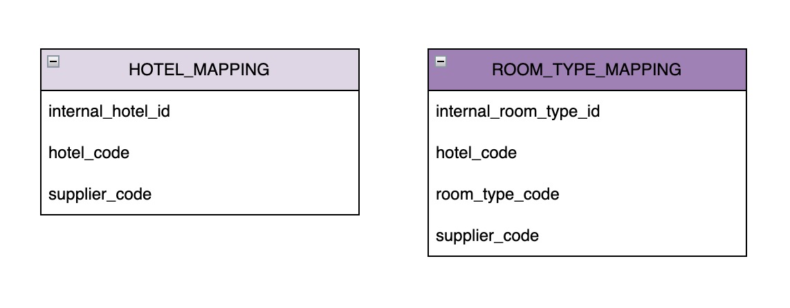

# channel-link

여러 상품 공급사(Supplier)의 서로 다른 API를 하나의 **표준 모델로 통합**하여, 단일 검색 API로 노출하는 백엔드 서비스

설계 의사결정과 트레이드오프는 [`docs/JOURNAL.MD`](docs/JOURNAL.MD)에, AI 페어 프로그래밍 활용 내역은 [`docs/AI.md`](docs/AI.md)

## 목차

* [체크리스트](#체크리스트)
* [기술 스택](#기술-스택)
* [시스템 아키텍처](#시스템-아키텍처)
* [주요 설계 의사결정](#주요-설계-의사결정)
* [트레이드오프 및 한계점](#트레이드오프-및-한계점)
* [실행 방법](#실행-방법)
* [API 명세](#api-명세)
* [프로젝트 구조](#프로젝트-구조)

## 체크리스트

### 기능

* [x] 통합 검색 API — `GET /api/v1/stays/search`
* [x] 서로 다른 실패 신호(A: HTTP 상태 / B: HTTP 200 + `resultCode`)를 `SupplierCallException` 하나로 통일
* [x] 부분 실패 허용 — 공급사 하나가 실패해도 정상 공급사의 결과 반환, `failedSuppliers`로 실패 공급사 표시
* [x] 연박 예약 가능 객실 수 계산 — 기간 내 날짜별 잔여 객실 수의 최솟값
* [x] 숙소/객실 타입 내부 식별자 매핑 — 최초 조회 시 자동 생성 후 재사용
* [x] 숙소 목록 갱신 — 애플리케이션 기동 시 1회 실행
* [x] 신규 공급사 추가에 열린 구조(OCP) — 기존 코드 수정 없이 어댑터 추가만으로 확장

### 추가 구현

* [x] 재시도 — resilience4j `@Retry`, 5xx·네트워크 오류만 재시도
* [x] 서킷브레이커 — resilience4j `@CircuitBreaker`, 공급사별 독립
* [x] 요금/재고 캐시 — TTL 설계 및 캐시 스탬피드 방지, 부하 테스트를 통한 TTL 검증
* [x] API 문서 자동화 — springdoc-openapi(Swagger UI)
* [x] 단위 테스트 — 핵심 도메인 로직 및 값 객체 검증
* [x] 성능/동시성 부하 테스트 — k6 기반 재현 가능한 스크립트

## 기술 스택

| 분류       | 사용 기술                                          |
| -------- | ---------------------------------------------- |
| 언어 / 런타임 | Java 21 (Virtual Threads)                      |
| 프레임워크    | Spring Boot 3.4.1                              |
| 빌드       | Gradle (Kotlin DSL), 멀티모듈                      |
| 영속성      | Spring Data JPA + H2                           |
| 캐시       | Spring Cache + Caffeine (`AsyncCache`)         |
| 재시도      | resilience4j (Retry, CircuitBreaker) + Reactor |
| API 문서   | springdoc-openapi (Swagger UI)                 |
| 테스트      | JUnit 5, Mockito, AssertJ                      |
| 부하 테스트   | k6, Bash + Python                              |

## 시스템 아키텍처

헥사고날(Port & Adapter) 아키텍처를 멀티모듈로 구성

`domain`/`application` 모듈에는 Spring·JPA·WebClient 등 프레임워크 의존성을 두지 않아, 아키텍처 경계를 빌드 단계에서 강제

### 모듈 별 설명

* **domain**: 표준 모델, 매핑 모델, Port 인터페이스
* **application**: Port(in)의 구현체인 유스케이스. Spring 의존성 없이 순수 Java로 작성
* **adapter-in-web**: REST Controller, Swagger
* **adapter-out-supplier**: 공급사 HTTP 연동, WebClient/Reactor, 캐시, Retry/CircuitBreaker
* **adapter-out-persistence**: 매핑 테이블 JPA 영속화
* **bootstrap**: 모든 모듈을 조립하는 최종 애플리케이션
* **mock-supplier**: 별도 프로세스(9090)로 실행되는 공급사 A/B Mock API

### 숙소 목록 갱신

애플리케이션 기동 시 `CommandLineRunner`가 1회 실행됨

`RefreshHotelCatalogService`가 등록된 모든 `SupplierPort`의 `fetchHotelCatalog()`를 호출하여 `HotelMapping`과 `RoomTypeMapping`을 생성

### 통합 검색


### 데이터 모델

`HotelMapping`/`RoomTypeMapping`만 영속화하며, 요금과 재고는 매 검색 시 공급사에서 조회

각 Mapping 테이블은 `(supplier_code, hotel_code[, room_type_code])`에 유니크 제약을 가지며, `internal_hotel_id`/`internal_room_type_id`를 PK로 사용



## 주요 설계 의사결정

### 1. 멀티모듈 + 헥사고날

`domain`/`application`의 빌드 파일에 프레임워크 의존성을 원천 차단하여, 아키텍처 경계를 코드 리뷰가 아닌 **빌드 단계에서 강제**

### 2. 매핑만 영속, 요금/재고는 라이브 조회

숙소 목록은 변경 빈도가 낮아 매핑 정보만 저장하고, 요금/재고는 실시간성이 중요하므로 저장하지 않고 검색 시 공급사에서 조회

### 3. `SupplierCallException`으로 실패 통일

Supplier A의 HTTP 상태 기반 실패와 Supplier B의 `HTTP 200 + resultCode` 기반 실패를 하나의 예외 타입으로 통일

예외 내부에 `retryable` 여부를 담아 5xx·네트워크 오류만 재시도하도록 구성

### 4. 레지스트리 패턴으로 공급사 확장

`SupplierPort`/`ReactiveSupplierSearch` 구현체를 Spring이 `List<T>`로 자동 수집하도록 구성

신규 공급사는 ENUM과 어댑터를 추가하는 것만으로 기존 검색 로직 수정 없이 확장(OCP).

### 5. 도메인은 동기, Adapter 내부는 리액티브

`SupplierSearchPort`는 동기 인터페이스로 유지하고, 실제 Supplier 호출이 발생하는 `adapter-out-supplier` 내부에서만 `Flux.flatMap`을 사용하여 공급사를 병렬 호출

리액티브 타입은 Adapter 외부로 노출하지 않음

### 6. 요금/재고 캐시

Caffeine `AsyncCache`를 사용하여 동일한 요청이 동시에 들어올 경우 진행 중인 Supplier 호출을 공유하고 캐시 스탬피드를 방지

캐시 키는 `(supplierCode, 숙소 코드 배치, SearchCriteria)`로 구성, TTL은 부하 테스트를 통해 **45초**로 설정

### 7. Retry + CircuitBreaker

`mock-supplier`의 `flaky` 모드를 활용하여 실패 확률을 조절하고 Retry 횟수별 성공률과 p99 지연시간을 비교

이를 바탕으로 `max-attempts=3`으로 설정했으며, Retry가 CircuitBreaker보다 바깥에서 동작하도록 구성

### 8. UUIDv7

내부 식별자에 무작위 UUIDv4 대신 시간 정렬 특성을 가진 UUIDv7을 사용하여 B-tree 인덱스의 지역성을 고려

## 트레이드오프 및 한계점

* **캐시 TTL의 staleness 비용 실측 불가**: 부하 테스트로 확인한 것은 캐시 히트율이며, 45초는 "더 늘려도 히트율 개선이 크지 않은 지점"의 근거임. 실제 데이터 변경 빈도와 허용 가능한 Staleness는 추가 검증이 필요
* **배치 내부는 순차 처리**: 한 공급사가 50개를 초과하는 숙소를 보유할 경우 배치를 나누고 `concatMap`으로 순차 처리함. 현재 규모에서는 문제가 없지만, 숙소가 대량으로 증가하면 `flatMap + concurrency 제한`으로 변경 가능.

## 실행 방법

### 사전 요구사항

* JDK 21

### 1. Mock Supplier 실행

```bash
./gradlew :mock-supplier:bootRun
```

* Port: `9090`
* 실제 외부 공급사 API를 대신하여 정상 응답 및 장애 상황을 재현

### 2. 애플리케이션 실행

```bash
./gradlew :bootstrap:bootRun
```

* Port: `8080`
* 애플리케이션 기동 직후 숙소 목록 갱신이 1회 실행

### 3. 검색 API 호출

```bash
curl 'http://localhost:8080/api/v1/stays/search?checkIn=2026-09-01&checkOut=2026-09-04&adults=2&children=0'
```

* Swagger UI: `http://localhost:8080/swagger-ui/index.html`
* H2 Console: `http://localhost:8080/h2-console`

    * JDBC URL: `jdbc:h2:mem:channel-link`
    * User: `sa`
    * Password: 없음

## API 명세

Swagger UI(`/swagger-ui/index.html`)

### `GET /api/v1/stays/search`

날짜·인원 조건으로 등록된 모든 공급사를 검색하여 하나의 표준 응답으로 반환

**Query Parameters**

| 이름         | 타입                    | 필수 | 설명                       |
| ---------- | --------------------- | -- | ------------------------ |
| `checkIn`  | `date` (`YYYY-MM-DD`) | O  | 체크인 날짜                   |
| `checkOut` | `date` (`YYYY-MM-DD`) | O  | 체크아웃 날짜 (`checkIn`보다 이후) |
| `adults`   | `int`                 | O  | 성인 수 (1 이상)              |
| `children` | `int`                 | X  | 어린이 수 (기본 0)             |


## 프로젝트 구조

```text
channel-link
├── domain
├── application
├── adapter-in-web
├── adapter-out-supplier
├── adapter-out-persistence
├── bootstrap
└── mock-supplier
```

각 모듈의 상세 역할은 [시스템 아키텍처](#시스템-아키텍처)를 참고


